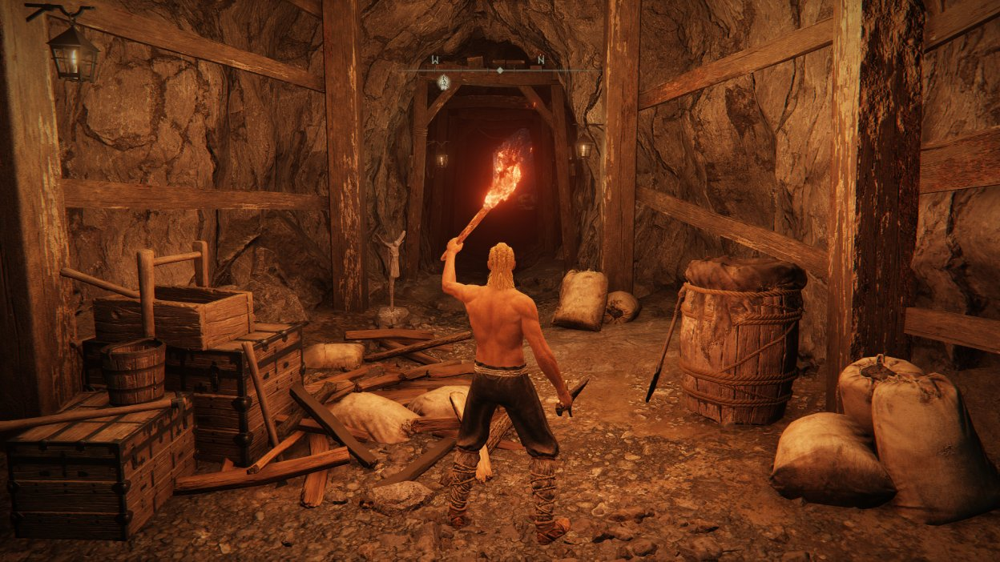
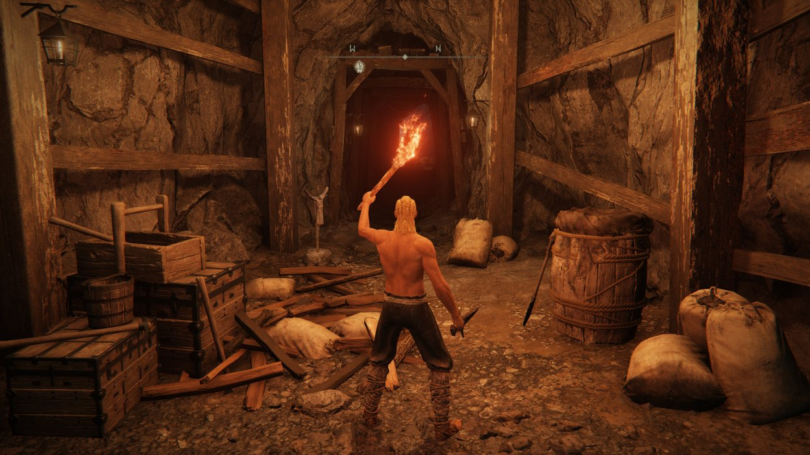

# Elden Ring force enable shadow casting
This small mod forces the game to cast dynamic shadows for everything.

Vanilla:


Patched:


## Installation
### ModEngine2

Place the DLL in your modengine2 folder and update the `config_eldenring.toml`'s external_dlls (or add it
to the file if it's not there yet).

```toml
# ...
external_dlls = ["eldenring_force_dynamic_shadows.dll"]
# ...
```

### Elden Mod Loader
Just chuck the DLL in the `mods` folder.